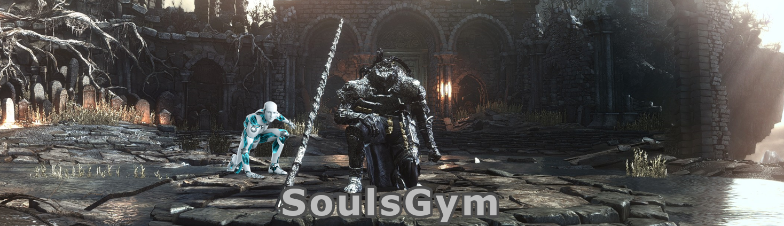

.. SoulsGym documentation master file, created by
   sphinx-quickstart on Tue Apr 19 18:27:24 2022.
   You can adapt this file completely to your liking, but it should at least
   contain the root `toctree` directive.

SoulsGym documentation
======================

SoulsGym is an extension of the `Gymnasium`_ module, the successor of OpenAI's gym for Reinforcement Learning in Python.
With SoulsGym you can train Reinforcement Learning algorithms on Dark Souls III bosses using the Gym API.
The video shows an example of an agent training against Iudex Gundyr. The game runs at 3x speed to accelerate training.

.. _Gymnasium: https://farama.org/Announcing-The-Farama-Foundation

.. raw:: html

   

        <iframe width="720" height="405" src="https://www.youtube.com/embed/7R5Ef69sFPE" title="YouTube video player" frameborder="0" allow="accelerometer; autoplay; clipboard-write; encrypted-media; gyroscope; picture-in-picture; web-share" allowfullscreen></iframe>
    

.. toctree::
   :maxdepth: 1
   :caption: Getting Started

   getting_started/setup
   getting_started/gym

.. toctree::
   :glob:
   :maxdepth: 2
   :caption: Python API

   soulsgym
   core/index
   games/index
   envs/index
   exception

.. toctree::
   :maxdepth: 1
   :caption: Notes

   notes/stability
   notes/acknowledgements

Indices and tables
==================

* :ref:`genindex`
* :ref:`modindex`
